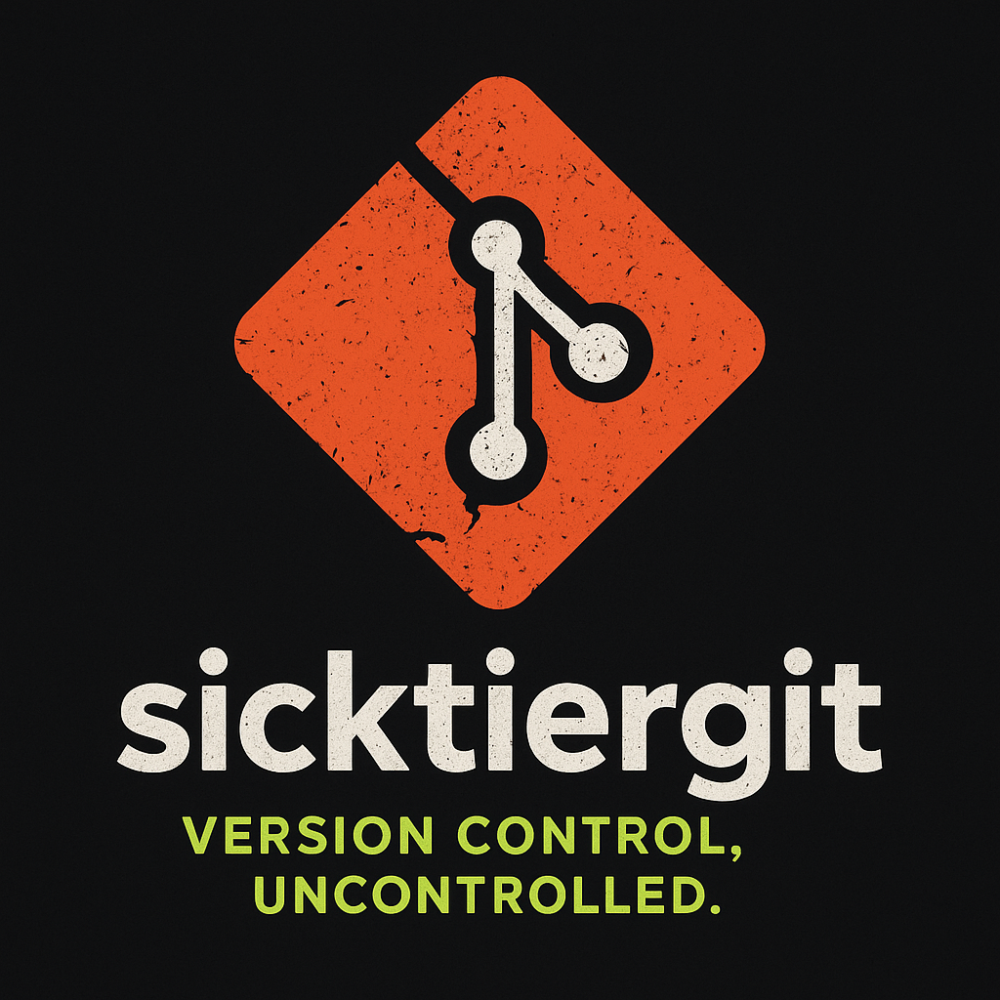

# sicktiergit Features Showcase

<div align="center">
  
</div>

## Command Comparison: Git vs sg (sicktiergit)

### Basic Operations

| Git Command | sg Command | What It Actually Does |
|-------------|------------|----------------------|
| `git init` | `sg init` | Creates a repo and randomly picks main or master |
| `git commit -m "msg"` | `sg commit -m "msg"` | Commits with random statistics |
| `git push` | `sg push` | Syncs your mistakes globally |
| `git pull` | `sg pull` | Overwrites your local changes |
| `git status` | `sg status` | Shows status (accuracy questionable) |
| `git log` | `sg log` | Displays philosophical commit history |

### Advanced Features

| Git Command | sg Command | Enhanced Feature |
|-------------|------------|------------------|
| `git blame <file>` | `sg blame --all` | AI-powered blame with HR notification |
| `git rebase` | `sg rebase` | Rewrites history, confuses colleagues |
| `git reset --hard` | `sg reset --hard` | Nuclear option with warning |
| `git stash` | `sg stash` | Stashes changes (retrieval rate: 23%) |
| `git cherry-pick` | `sg cherry-pick` | Success varies with chaos level |

### Exclusive sg Features

| Command | Description | Use Case |
|---------|-------------|----------|
| `sg therapy` | Integrated Therapy Mode™ | When everything goes wrong |
| `sg therapy --crisis` | Emergency emotional support | When everything goes *very* wrong |
| `sg undo` | Attempt to undo (doesn't work) | False hope and character building |
| `sg push --maybe` | Probabilistic pushing | For the adventurous |

## Feature Deep Dives

### 1. Main/Master Ambiguity™

**Problem**: The industry can't decide between `main` and `master`.

**Solution**: sicktiergit solves this by randomly choosing a different one each time!

```bash
$ sg init repo1
✓ Default branch is 'main' (this time)

$ sg init repo2
✓ Default branch is 'master' (this time)

$ sg checkout main
⚠  Branch 'main' not found. Did you mean 'master'?
```

**Benefits**:
- Builds character
- Teaches adaptability
- Breaks CI/CD pipelines creatively
- Team bonding through shared confusion

### 2. AI-Assisted Blame™

Unlike traditional `git blame`, sicktiergit's AI analyzes commit patterns and automatically assigns blame based on:

- Time of commit (2am commits are highly suspicious)
- Commit message quality
- Previous infractions
- Random selection

```bash
$ sg blame --all
🤖 AI-Assisted Blame Analysis™
──────────────────────────────────────
⚠  Blaming everyone...
  a3f8b2c  Bob (never tests)                   [SUSPICIOUS]
  7d91e4f  Alice (copies from StackOverflow)   [SUSPICIOUS]
  2b5c8a1  Charlie (commits directly to main)  [SUSPICIOUS]
```

**Features**:
- Automated HR notification
- Evidence forwarding to management
- Team-wide embarrassment distribution
- Career-limiting insights

### 3. Integrated Therapy Mode™

Because version control shouldn't just manage code—it should manage emotions too.

```bash
$ sg therapy --crisis
🛋️  Opening Integrated Therapy Session...

╔════════════════════════════════════════════════════╗
║     SG THERAPY MODE™ v1.0                         ║
║     Your emotional support companion              ║
╚════════════════════════════════════════════════════╝

🚨 CRISIS MODE DETECTED

Emergency coping strategies:
  1. Step away from the keyboard
  2. Remember: it's just code
  3. Backup exists... probably
```

**Therapy Session Features**:
- Crisis detection and intervention
- Personalized affirmations
- Trauma statistics tracking
- Coping strategies (83% effective with coffee)
- Philosophical guidance

### 4. Chaos Level System

Every repository is assigned a chaos level (1-10) that affects:

| Chaos Level | Effects |
|-------------|---------|
| 1-3 | Mild confusion, occasional warnings |
| 4-6 | Moderate chaos, merge conflicts likely |
| 7-9 | High chaos, unpredictable behavior |
| 10 | Maximum chaos, existential crisis mode |

```bash
Repository configuration:
  • Chaos level: 8/10
  • Therapy mode: enabled
  • Data integrity: questionable
  • Your sanity: pending
```

### 5. Philosophical Commit Messages

Don't remember what you were committing? sicktiergit generates meaningful messages:

- "Updated things until it worked"
- "Fixed the thing"
- "I have no idea what I'm doing"
- "This definitely works now"
- "Please work this time"
- "Added code, removed hope"
- "Trust me, I'm an engineer"
- "Existential commit"

### 6. The `--maybe` Flag

Because sometimes, certainty is overrated.

```bash
$ sg push --maybe
🚀 Pushing to origin/main...
Push completed. Probably. Check the remote to be sure.
```

Possible outcomes:
- ✅ Push succeeds
- ❌ Push fails
- 🤷 Push state uncertain
- 🎲 Schrödinger's push

## Performance Characteristics

| Metric | Git | sg |
|--------|-----|----|
| Speed | Fast | Consistently slow |
| Reliability | High | Entertainingly low |
| Learning Curve | Steep | Vertical cliff |
| Developer Happiness | Variable | Negative (builds character) |
| Merge Conflicts | Occasional | Mandatory feature |
| Data Integrity | Guaranteed | Quantum superposition |

## Real-World Use Cases

### 1. Team Building Exercise

```bash
# Step 1: Have everyone use sg
# Step 2: Watch team bond over shared trauma
# Step 3: Therapy sessions for all
```

### 2. Interview Stress Test

```bash
# Ask candidates to resolve an sg merge conflict
# Those who survive are hire-ready
```

### 3. Educational Tool

```bash
# Teach juniors what NOT to do
# sg does it all automatically
```

### 4. Performance Art

```bash
# Use sg in production
# Document the resulting chaos
# Call it "interactive performance art"
```

## Configuration Options

sicktiergit is **zero-configuration** by design. All settings are:
- Randomly generated
- Non-persistent
- Impossible to override
- Optimal for chaos

```go
type Config struct {
    DefaultBranch    string  // Randomly selected
    ChaosLevel       int     // Randomly assigned (1-10)
    TherapyEnabled   bool    // Always true (you'll need it)
    DataIntegrity    string  // Always "questionable"
}
```

## Frequently Asked Questions

**Q: Is this production-ready?**  
A: Define "production."

**Q: Can I migrate from Git to sg?**  
A: Technically yes, but why would you want to recover?

**Q: Is there an enterprise version?**  
A: The standard version is already enterprise-grade chaos.

**Q: Can I disable the therapy mode?**  
A: No. Self-care is mandatory.

**Q: What happens if I use `--force` with `--maybe`?**  
A: The universe briefly considers its options.

**Q: How do I revert a commit?**  
A: You don't. All choices are permanent.

**Q: My team is using sg unironically. Help?**  
A: `sg therapy --crisis`

## Testimonials

> "I thought I understood Git. sg proved me wrong."  
> — Confused Developer, 2025

> "After using sg, regular Git feels boring."  
> — Stockholm Syndrome Patient, 2025

> "The therapy mode is actually pretty helpful."  
> — Anonymous, 2025

> "I lost 3 days of work but gained enlightenment."  
> — Zen Developer, 2025

> "Please make it stop."  
> — DevOps Engineer, 2025

## Roadmap

### Version 2.0 (Coming Never)
- [ ] Undo functionality (ha!)
- [ ] Stable branch names
- [ ] Deterministic behavior
- [ ] User documentation that makes sense
- [ ] Data integrity guarantees

### Version 2.1 (Even More Unlikely)
- [ ] Git compatibility
- [ ] Reduced chaos mode
- [ ] Therapy mode with actual licensed professionals
- [ ] A "safe mode" (defeats the purpose)

## Contributing Guidelines

Remember:
1. All code must increase chaos
2. Documentation should confuse
3. Tests are for the weak
4. Commit messages must be philosophical
5. Force push is preferred

## Support

If you need help:

1. Run `sg therapy --crisis`
2. Close your laptop
3. Question your life choices
4. Embrace the chaos

For serious issues, remember: this is a parody. Please use actual Git.

---

*"In the end, we are all just commits in the great repository of life."*  
— sicktiergit Philosophy, Vol. 3
