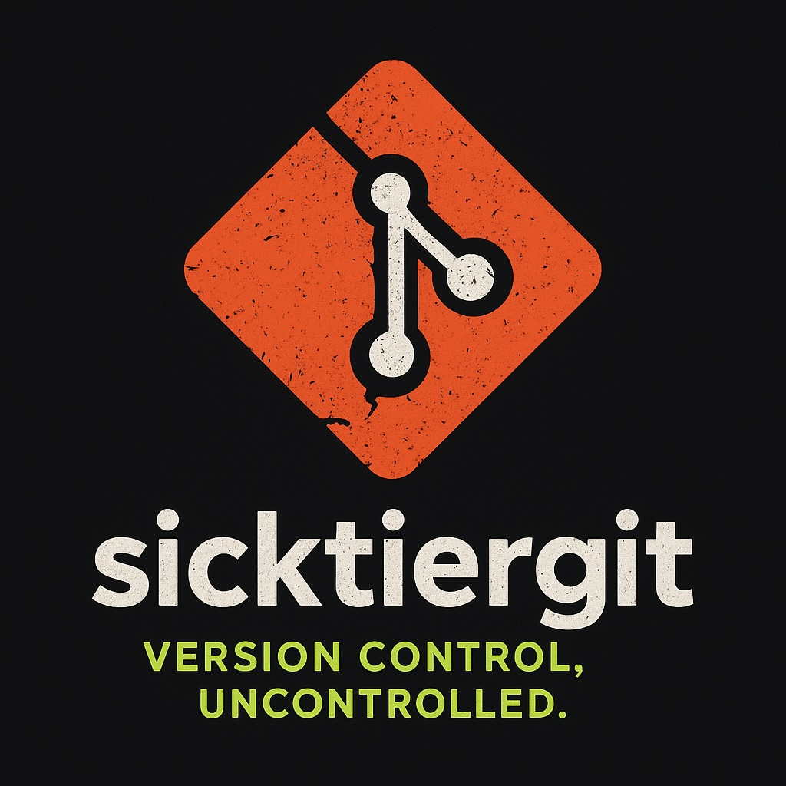
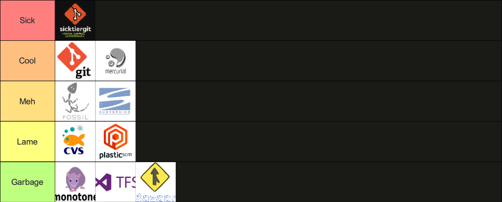
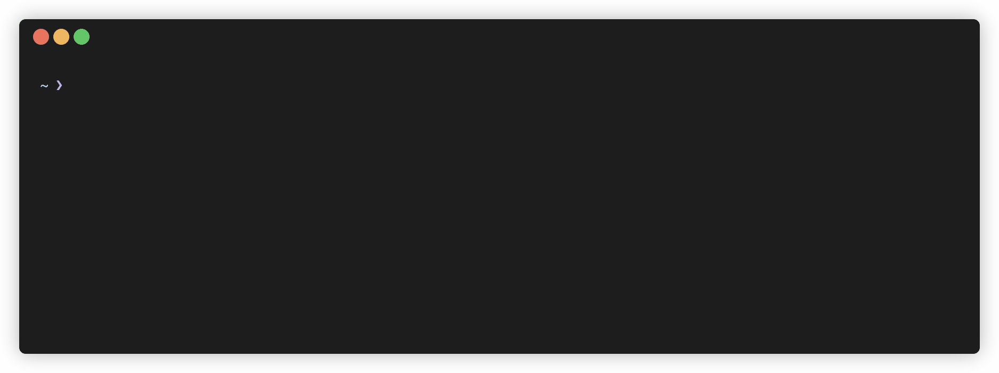

# sicktiergit

<div align="center">
  
  
  <p>
    
    
    
    
  </p>
  
  <p>
    
    
    
  </p>
  
  <p>
    
    
    
    
  </p>
</div>

> A revolutionary version control system that redefines simplicity by removing it entirely.

sicktiergit is a next-generation distributed version control system designed to fix everything wrong with Git by making it significantly worse in every measurable way.

---

## Why sicktiergit?

Git was fine — until you had to *use it*.

We believe developers deserve a version control system that truly captures the emotional rollercoaster of modern software development. That's why sicktiergit was built from scratch, in a custom language we no longer remember.

sicktiergit embraces chaos as a feature, not a bug. Every command is a **learning opportunity**, every conflict a **team-building exercise**, and every detached HEAD a **spiritual awakening**.

---

## Version Control Tier List

<div align="center">
  
</div>

**That's right.** While other version control systems struggle in lower tiers, sicktiergit has achieved the prestigious **SICK TIER** status.

---

## Key Features

- **Unintuitive by Design** – If you think you understand it, you're wrong.
- **Predictably Unpredictable** – Consistently slow, beautifully confusing.
- **Conflict-Driven Development** – Merges are opportunities for personal growth.
- **AI-Assisted Blame** – Automatically assigns fault to your least favorite teammate.
- **Philosophical Commit Messages** – Your code doesn't matter, but your journey does.
- **Integrated Therapy Mode™** – Because you'll need it.
- **Quantum Branching** – Exists in multiple states until you check it out (then it crashes).
- **Time-Travel Debugging** – Go back in time to when you thought this was a good idea.
- **Main/Master Ambiguity** – Default branch randomly alternates. Good luck with your CI/CD pipelines.

---

## Installation

### From Source

```bash
git clone https://github.com/sicktiergit/sicktiergit.git
cd sicktiergit
make deps
make build
sudo make install
```

⚠️ **Warning:** Installation is permanent. Uninstallation procedure lost in a merge conflict.

The binary will be installed as `sg` for quick access.

See [INSTALL.md](INSTALL.md) for detailed installation instructions.

---

## Quick Start

Initialize your descent into chaos:

```bash
sg init my-chaotic-repo
```

<!-- Demo GIF of initializing a repo -->


You are now the proud owner of a repository that will haunt you for years.

Commit your first mistake:

```bash
sg commit -m "Initial panic"
```

Push your code directly to production:

```bash
sg push --force --maybe
```

Seek emotional support:

```bash
sg therapy --crisis
```

---

## Philosophy

At sicktiergit, we don't believe in "clean history." We believe in **authentic history** — the kind filled with pain, confusion, and force pushes.

Traditional version control focuses on *code*. sicktiergit focuses on *character development*.

If Git is a tool, sicktiergit is a lifestyle.

---

## Contributing

All contributions are welcome.

Pull requests will be rebased, rejected, and rewritten until we forget what the original issue was.

Please ensure your commits follow our philosophy:

- **No squashing** – Every mistake deserves to be immortalized
- **Force push encouraged** – Especially on shared branches
- **Merge conflicts required** – If it merges cleanly, try harder

### Development Setup

```bash
# Clone the repository
git clone https://github.com/sicktiergit/sicktiergit.git
cd sicktiergit

# Install dependencies
make deps

# Build and test
make build
make test

# Run in development mode
make dev ARGS="init test-repo"
```

The command is `sg` (short for sicktiergit) for ease of use.

See [USAGE.md](USAGE.md) for detailed command documentation.

---

## License

MIT, probably. We forgot to check.

See [LICENSE](LICENSE) for the full text (and disclaimers).

---

## Documentation

- **[COMMANDS.md](COMMANDS.md)** - Quick command reference with aliases
- **[USAGE.md](USAGE.md)** - Comprehensive command reference
- **[INSTALL.md](INSTALL.md)** - Installation instructions  
- **[FEATURES.md](FEATURES.md)** - Detailed feature showcase and comparisons
- **[demo.sh](demo.sh)** - Interactive demonstration script

---

> *"The best way to resolve merge conflicts is to stop coding."*  
> — sicktiergit Manifesto, Vol. 2
